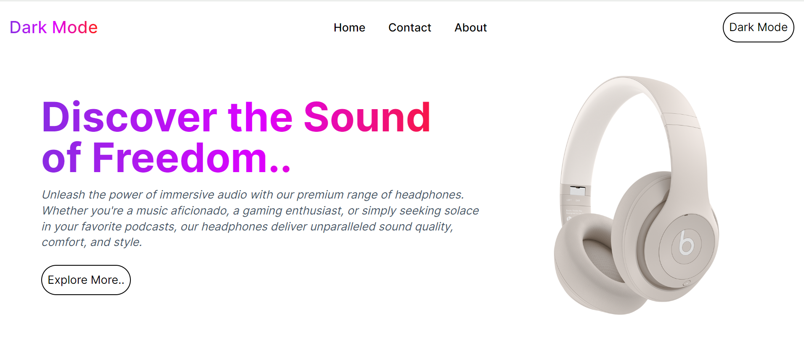
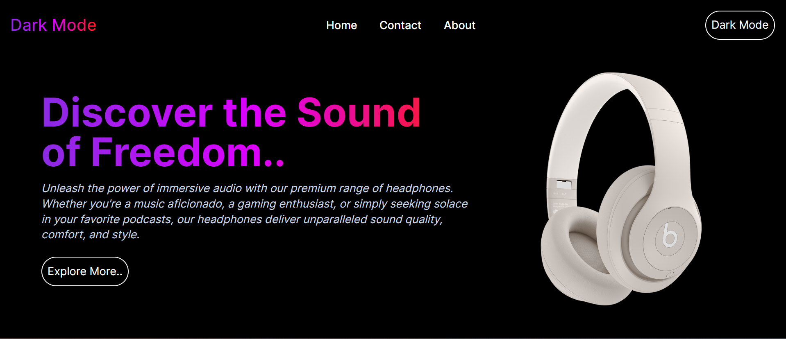

# My Awesome Mini Project

## Dark Mode using Context API

Welcome to my Mini project! In this project, I've implemented a dark mode feature using React Context API. With dark mode, users can enjoy a sleek and stylish interface that reduces eye strain, especially in low-light environments.

### About

This project is built with JavaScript and utilizes the power of React.js and its Hooks. I've also used Styled Components for styling to maintain a modular and maintainable codebase. Additionally, Tailwind CSS has been employed to streamline the styling process and add a responsive design to the project.

### Technologies Used

- 
- 
- 
- 

### Light Mode Preview



### Dark Mode Preview



### Installation

1. Clone the repository:

   ```bash
   git clone https://github.com/ammndeep/Dark-mode-Context-API.git
   ```
